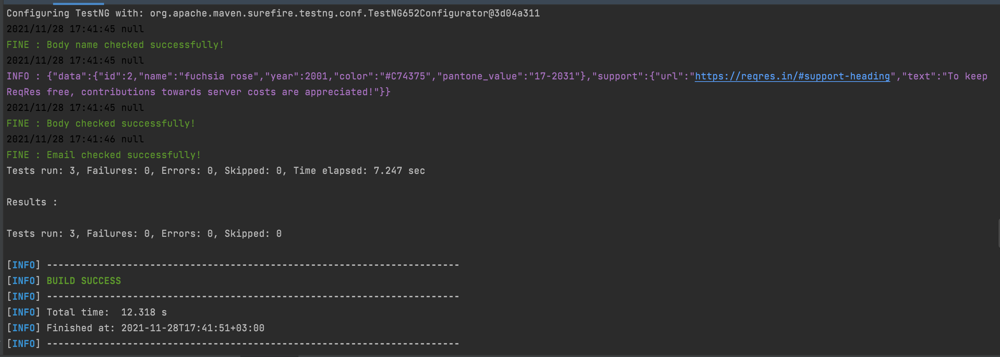

# RestAssuredAPITests
Example of rest assured API test usage in Java

### Built With

- [Rest-assured](https://mvnrepository.com/artifact/io.rest-assured/rest-assured/4.2.0)
- [TestNG](https://mvnrepository.com/artifact/org.testng/testng/7.4.0)

### Prerequisites

The recommended method to install **Java** is by using 
[Oracle](https://www.oracle.com/tr/java/technologies/javase-downloads.html).
Recommended version is java 11.

Jetbrains IntelliJ IDEA Installation
[IntelliJ IDEA](https://www.jetbrains.com/idea/download).


To be able to run with mvn;

#### MacOS

The simplest way to install Maven on your Mac OS is using brew command.
```sh
brew install maven
```
If you don't have homebrew you can download with
```sh
/bin/bash -c "$(curl -fsSL https://raw.githubusercontent.com/Homebrew/install/HEAD/install.sh)"
```


### Usage

#### Running tests
You can run this command in the command line where you are in the project path.
```sh
mvn clean test
```
Also you can run the test from the each method or with class.


#### Results


